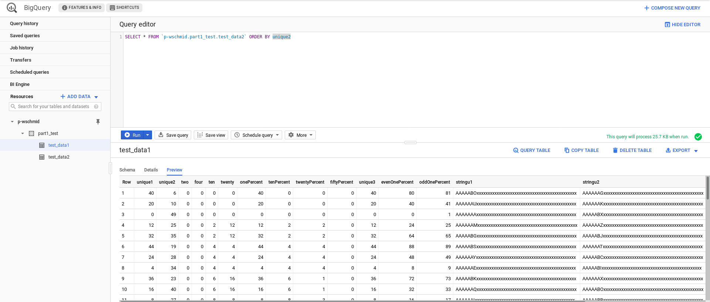

Will Schmid
CS 487P Spring 2019
4/22/19

# Project Part 1

For this part of the project, I wrote code to generate test data for future use in benchmarking the performance of different database systems. I've been working a lot recently in JavaScript, so I decided to write my data generation code as a Node app. The schema used is from the Wisconsin Benchmark paper provided to the class, as well as the methods to generate unique integers and convert said integers into unique strings. I didn't run into any major issues writing the code, other than some typical JS async finickyness writing the data to a file (a problem solved by using synchronous methods provided by the `fs` package). One other minor issue I ran into was that the prime numbers used in the generation of random unique integers seemed to start getting cutoff in the PDF of the paper I was using, so I had to go find the first prime after 10,000,000 and 100,000,0000 on the internet.

I decided to use the Google Cloud Platform for the project, largely so that I could get more experience using cloud based data systems. Specifically, I'll be using the BigQuery service. My experience so far has been with local systems such as Postgres, MySQL, and SQLite. As cloud systems get more popular, I think it would be good to get some hands on time with one to see what using one is really like. In all honesty, figuring out the billing configuration for the GCP account was harder than any programming I did for this project. I eventually figured it out though, and was able to successfully load some test data into the system. This is shown in the image below:

Based on my experience so far with it, I can already tell GCP seems to have a lot of the same drawbacks that other cloud based services I've used. These include an intimidating amount of upfront information and options, confusing menus within menus, and I get the sense that updates frequently invalidate documentation. For instance the dashboard and forms I went through to set up my account differed from the screenshots used in the slides going over the process, slides I assume were made relatively recently. As far as positives go, it was trivially easy to upload my `.csv` files and run a few test queries on them. I'm sure I'll find more to like (and probably more to dislike too) as I use the system.